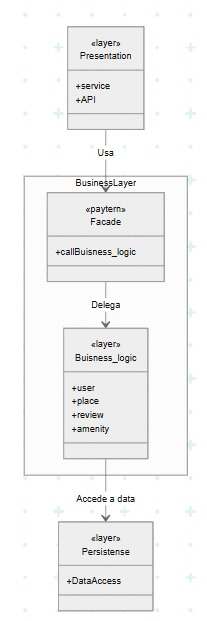
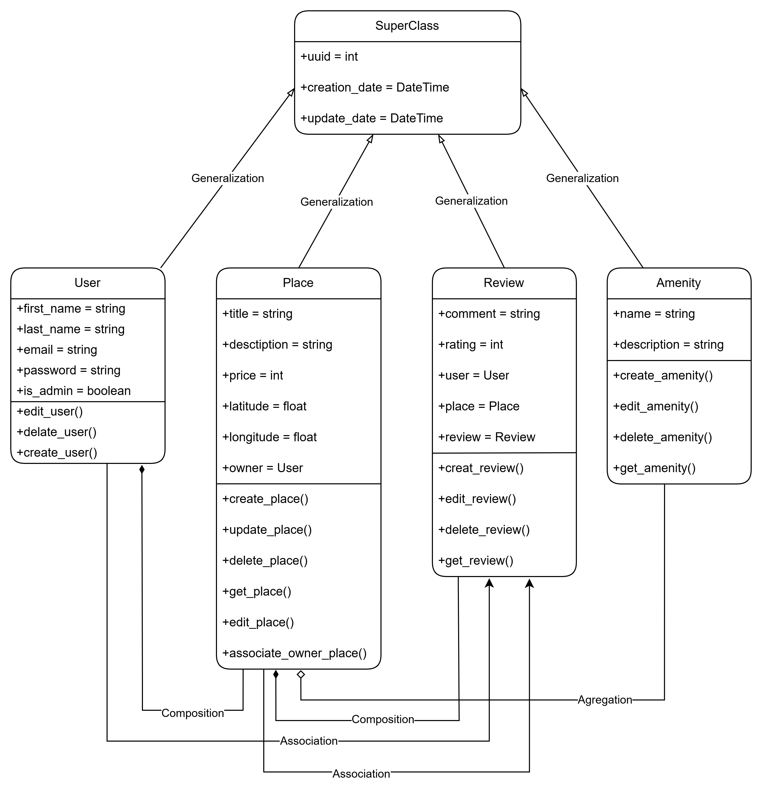
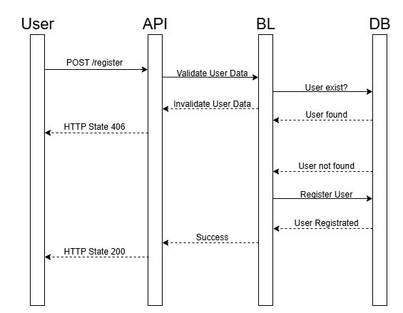
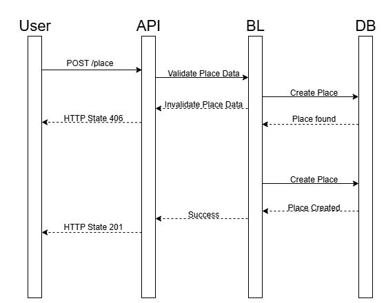
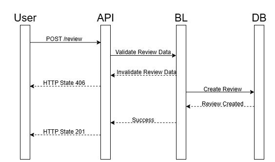
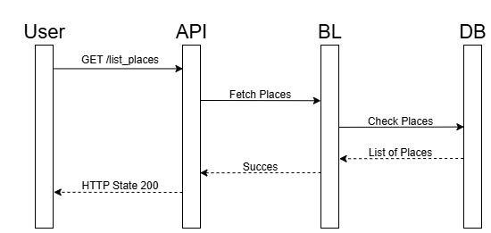

# HBnB

**By Geronimo Negreira, Agustín Lahalo, and Bruno Dos Santos – #C26**

# **Introduction**

We carried out this project with the goal of understanding how an application similar to Airbnb might work internally. We focused on designing a clear, layered architecture that would serve as a conceptual foundation for future implementations.

In this document, we explain how we reasoned through the overall design of the system, which tools we used, and we present the diagrams that represent both the structure and the behavior of the project.

## **Project Contents**

The work is composed of three main types of diagrams:

- High-Level Package Diagram (General Architecture)
- Class Diagram
- Sequence Diagrams

All diagrams were created using Draw.io.

## **General System Architecture**

This diagram represents the main flow of the application. It is organized into three layers that interact with each other to process user requests:

## **System Layers:**

### **Presentation Layer:**

Responsible for receiving user requests (e.g., via an API or web interface), validating them, and forwarding them to the system logic. It also formats the response and returns it to the user.

### **Business Logic Layer:**

Manages business rules, decides how to handle information, and communicates with the database. It is the core of the system.

### **Persistence Layer:**

Connects to the database. It handles storing, retrieving, and modifying data.

### **System Flow:**

The user performs an action through the interface.

The API receives and validates the request.

The request is passed to the business logic layer, which decides what to do.

If needed, the database is queried.

The information is processed and sent back to the interface.

The user receives a clear, formatted response.

This architecture allows the system to be modular, easy to maintain, and scalable.

### **Class Diagram**

The class diagram allowed us to visualize the main entities of the system and their relationships. We designed it with the goal of avoiding duplicated code and maintaining a clear structure.

### **Main Classes:**

- **SuperClass:** Parent class that contains common attributes like ID, creation date, and update date. All other classes inherit from this.
- **User:** Represents a system user. May have administrator permissions.
- **Place:** Accommodations that a user can create.
- **Review:** Reviews that users leave about a place.
- **Amenity:** Extra features a place can have (e.g., WiFi, air conditioning).

## Class Diagram

### **Relationships:**

- All classes inherit from SuperClass.
- A User can have multiple Place instances.
- A Place can have multiple Review and Amenity instances.
- A Review is linked to both a User and a Place.

This structure provides a clear and scalable organization for the system.

### **Sequence Diagrams**

These diagrams show how different parts of the system communicate when an action occurs. Below we explain the main use cases:

### **User Registration:**

The user enters their information through the interface.

The API validates the email and password.

It checks if the user already exists in the database.

If everything is valid, the new user is saved.

A successful registration confirmation is sent.

### **Creating a Listing:**

The user submits the place information.

The data is validated.

It checks whether the listing already exists.

If not, a new one is created in the database.

The operation is confirmed.

### **Submitting a Review:**

The user writes a review from the interface.The system validates that a user and place are associated.The review is saved in the database.

A success notification is returned.

### **Listing Accommodations:**

The user requests to view all listings.

The database is queried.

The results are organized.

The results are sent back to the user.

## **Design Decisions**

- **Layered Architecture:**
    
    Allows us to divide responsibilities and make the system easier to maintain and modify.
    
- **Class Model:**
    
    Helps prevent redundancy and makes the code cleaner and easier to understand.
    
- **Sequence Diagrams:**
    
    Useful for visualizing internal logic and detecting potential issues before coding.
